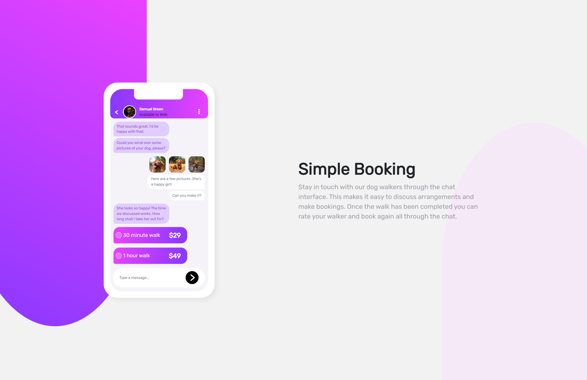

# Frontend Mentor - Chat-app-CSS-illustration solution

This is a solution to the [Chat app CSS illustration challenge on Frontend Mentor](https://www.frontendmentor.io/challenges/chat-app-css-illustration-O5auMkFqY/hub/chat-app-css-illustration-gQMSFGUjCY).
Frontend Mentor challenges help you improve your coding skills by building realistic projects. 

## Table of contents

- [Overview](#overview)
  - [The challenge](#the-challenge)
  - [Screenshot](#screenshot)
  - [Links](#links)
- [My process](#my-process)
  - [Built with](#built-with)
  - [What I learned](#what-i-learned)
  - [Useful resources](#useful-resources)
- [Author](#author)

## Overview

### The challenge

The challenge was to reach as close to the design given by Frontend Mentor And..

Users should be able to:

- View the optimal layout depending on their device's screen size

### Screenshot

### Links

- Solution URL: [solution code](https://github.com/Gautambudh/Chat-app-CSS-illustration.git)
- Live Site URL: [page](https://gautambudh.github.io/Chat-app-CSS-illustration/)

## My process
Made this mobile design having user interface for chats from scratch with core html, css and bootstrap.

### Built with

- Semantic HTML5 markup
- CSS custom properties
- Bootstrap (grid sysytem)

### What I learned

I learnt overflow:hidden property in css to hide the scrollbar. Also i got to practice more over Bootstrap grid system for
responsive layout designs. Designing the mobile and its user interface from scratch was bit challenging and i truly enjoyed while
working on it.
Further i'm looking to add few more stuff like animations and all.

### Useful resources
**w3schools helped me a lot in getting familiar with lots of CSS properties and while working with Bootstrap5**

## Author

- Frontend Mentor - [@Gautambudh](https://www.frontendmentor.io/profile/Gautambudh)

